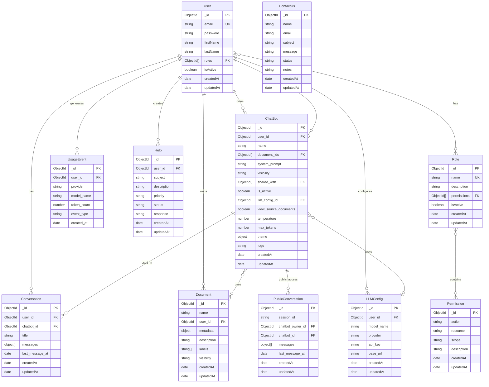

# Database Schema

## Overview

- **Database**: MongoDB 6.0+ with Mongoose ODM
- **Replica Set**: Required for transactions (`rs0`)
- **Connection**: Singleton pattern with connection pooling (maxPoolSize: 10)
- **Transactions**: Supported for critical operations (chat messages, document creation)

Connection configuration: [config/database/connection.ts](../../node-backend/src/config/database/connection.ts)

---

## Entity Relationship Diagram



---

## Models

### User

**File**: [models/User.ts](../../node-backend/src/models/User.ts)

**Fields**:
- `_id` (ObjectId, PK) - Unique identifier
- `email` (string, required, unique) - User email address, lowercase, validated with regex
- `password` (string, required, min 8 chars) - Bcrypt hashed password (select: false)
- `firstName` (string, required) - User's first name
- `lastName` (string, required) - User's last name
- `roles` (ObjectId[], ref: Role) - Array of role references for RBAC
- `isActive` (boolean, default: true) - Account status flag
- `createdAt` (Date, auto) - Account creation timestamp
- `updatedAt` (Date, auto) - Last update timestamp

**Indexes**: `email` (unique)

**Pre-save Hooks**:
- Hash password with bcrypt (12 rounds) if modified
- Assign default "User" role if no roles specified

**Methods**:
- `comparePassword(candidatePassword)` - Verify password with bcrypt

**Relationships**:
- Many-to-Many with `Role` (via roles array)
- One-to-Many with `ChatBot`, `Document`, `Conversation`, `LLMConfig`, `UsageEvent`, `Help`

---

### Role

**File**: [models/Role.ts](../../node-backend/src/models/Role.ts)

**Fields**:
- `_id` (ObjectId, PK) - Unique identifier
- `name` (string, required, unique) - Role name (e.g., "Admin", "User")
- `description` (string, optional) - Role description
- `permissions` (ObjectId[], ref: Permission) - Array of permission references
- `isActive` (boolean, default: true) - Role status flag
- `createdAt` (Date, auto) - Creation timestamp
- `updatedAt` (Date, auto) - Last update timestamp

**Indexes**: `name` (unique)

**Relationships**:
- Many-to-Many with `User` (referenced by User.roles)
- Many-to-Many with `Permission` (via permissions array)

**Default Roles** (seeded via `npm run seed:rbac`):
- **Admin**: 26 permissions (platform-wide access)
- **User**: 24 permissions (self-scoped resources only)

---

### Permission

**File**: [models/Permission.ts](../../node-backend/src/models/Permission.ts)

**Fields**:
- `_id` (ObjectId, PK) - Unique identifier
- `action` (string, required) - Action type: CREATE, READ, UPDATE, DELETE
- `resource` (string, required) - Resource type: PROFILE, USER, CHATBOT, DOCUMENT, etc.
- `scope` (string, required) - Scope level: ALL (global) or SELF (own resources)
- `description` (string, optional) - Human-readable description
- `createdAt` (Date, auto) - Creation timestamp
- `updatedAt` (Date, auto) - Last update timestamp

**Indexes**: `(action, resource, scope)` (unique compound index)

**Permission Format**: `action:resource:scope` (e.g., `create:chatbot:self`)

**Relationships**:
- Many-to-Many with `Role` (referenced by Role.permissions)

**Total Permissions**: 45 (seeded)

---

### ChatBot

**File**: [models/ChatBot.ts](../../node-backend/src/models/ChatBot.ts)

**Fields**:
- `_id` (ObjectId, PK) - Unique identifier
- `user_id` (ObjectId, required, ref: User) - Chatbot owner
- `name` (string, required) - Chatbot display name
- `document_ids` (ObjectId[], ref: Document) - Documents for RAG context
- `system_prompt` (string, default: "You are a helpful AI assistant.") - System instructions for LLM
- `visibility` (string, enum: PUBLIC/PRIVATE/SHARED, default: PRIVATE) - Access control level
- `shared_with` (ObjectId[], ref: User) - Users with shared access (if visibility=SHARED)
- `is_active` (boolean, default: true) - Chatbot status flag
- `llm_config_id` (ObjectId, optional, ref: LLMConfig) - Custom LLM configuration
- `view_source_documents` (boolean, default: true) - Show RAG sources in responses
- `temperature` (number, 0-2, default: 0.7) - LLM creativity parameter
- `max_tokens` (number, default: 2000) - Maximum response length
- `theme` (object) - UI customization (30+ color properties for light/dark modes)
- `logo` (string, optional) - Logo URL
- `createdAt` (Date, auto) - Creation timestamp
- `updatedAt` (Date, auto) - Last update timestamp

**Indexes**: `user_id`, `visibility`

**Visibility Levels**:
- `PUBLIC`: Anyone can chat (no auth required)
- `PRIVATE`: Owner only
- `SHARED`: Owner + users in shared_with array

**Relationships**:
- Belongs to `User` (owner via user_id)
- Many-to-Many with `Document` (via document_ids)
- May reference `LLMConfig` (via llm_config_id)
- One-to-Many with `Conversation`, `PublicConversation`
- Many-to-Many with `User` (via shared_with for SHARED visibility)

---

### Document

**File**: [models/Document.ts](../../node-backend/src/models/Document.ts)

**Fields**:
- `_id` (ObjectId, PK) - Unique identifier
- `name` (string, required) - Document title
- `user_id` (ObjectId, required, ref: User) - Document owner
- `metadata` (object) - Indexing metadata
  - `chunk_count` (number) - Total number of chunks
  - `status` (string, enum: pending/indexed/failed) - Indexing status
- `description` (string, optional) - Document description
- `labels` (string[], optional) - Tags for organization (e.g., ["manual", "api-docs"])
- `visibility` (string, enum: PUBLIC/PRIVATE, default: PRIVATE) - Access control
- `createdAt` (Date, auto) - Creation timestamp
- `updatedAt` (Date, auto) - Last update timestamp

**Indexes**: `user_id`, `labels`

**Status Flow**:
1. `pending` - Document created, indexing in progress
2. `indexed` - Chunks successfully embedded in Qdrant
3. `failed` - Indexing error

**Relationships**:
- Belongs to `User` (owner via user_id)
- Referenced by `ChatBot.document_ids` (many-to-many)

**Note**: Actual text chunks stored in **Qdrant** (vector DB), not MongoDB

---

### Conversation

**File**: [models/Conversation.ts](../../node-backend/src/models/Conversation.ts)

**Fields**:
- `_id` (ObjectId, PK) - Unique identifier
- `user_id` (ObjectId, required, ref: User) - Conversation owner
- `chatbot_id` (ObjectId, required, ref: ChatBot) - Associated chatbot
- `title` (string, default: "New Conversation") - Conversation title
- `messages` (object[], required) - Chat history array
  - `role` (string, enum: user/assistant/system) - Message sender
  - `content` (string) - Message text
  - `chunk_ids` (string[]) - Source document chunk UUIDs (for assistant messages)
  - `timestamp` (Date) - Message timestamp
- `last_message_at` (Date) - Last activity timestamp
- `createdAt` (Date, auto) - Creation timestamp
- `updatedAt` (Date, auto) - Last update timestamp

**Indexes**: `(user_id, chatbot_id)` (compound), `last_message_at` (descending)

**Message Roles**:
- `user`: User input
- `assistant`: AI response (includes chunk_ids for RAG sources)
- `system`: System prompts (internal)

**Relationships**:
- Belongs to `User` (via user_id)
- Belongs to `ChatBot` (via chatbot_id)

**Transaction Support**: Updates wrapped in transaction with `UsageEvent` creation

---

### PublicConversation

**File**: [models/PublicConversation.ts](../../node-backend/src/models/PublicConversation.ts)

**Fields**:
- `_id` (ObjectId, PK) - Unique identifier
- `session_id` (string, required) - Frontend-generated UUID for session tracking
- `chatbot_owner_id` (ObjectId, required, ref: User) - Chatbot owner (for usage tracking)
- `chatbot_id` (ObjectId, required, ref: ChatBot) - Associated chatbot
- `messages` (object[], required) - Chat history (same structure as Conversation)
  - `role` (string, enum: user/assistant)
  - `content` (string)
  - `chunk_ids` (string[])
  - `timestamp` (Date)
- `last_message_at` (Date) - Last activity timestamp
- `createdAt` (Date, auto) - Creation timestamp
- `updatedAt` (Date, auto) - Last update timestamp

**Indexes**: `(session_id, chatbot_id)` (compound, unique), `last_message_at` (descending)

**Purpose**: Anonymous chat sessions for PUBLIC chatbots (no user login required)

**Usage Tracking**: `UsageEvent` records created with `chatbot_owner_id` as user

**Relationships**:
- References `ChatBot` (via chatbot_id)
- References `User` (chatbot owner for billing via chatbot_owner_id)

---

### LLMConfig

**File**: [models/LLMConfig.ts](../../node-backend/src/models/LLMConfig.ts)

**Fields**:
- `_id` (ObjectId, PK) - Unique identifier
- `user_id` (ObjectId, required, ref: User) - Configuration owner
- `model_name` (string, required) - LLM model name (e.g., "gpt-4", "llama2")
- `provider` (string, enum: OPENAI/OLLAMA, required) - LLM provider type
- `api_key` (string, conditional) - Required for OpenAI provider
- `base_url` (string, conditional) - Required for Ollama provider (e.g., http://localhost:11434)
- `createdAt` (Date, auto) - Creation timestamp
- `updatedAt` (Date, auto) - Last update timestamp

**Indexes**: `user_id`

**Purpose**: Users configure their own LLM providers instead of sharing central API keys

**Providers**:
- **OpenAI**: Requires `api_key`, `model_name` (gpt-4, gpt-3.5-turbo, etc.)
- **Ollama**: Requires `base_url`, `model_name` (llama2, mistral, etc.)

**Relationships**:
- Belongs to `User` (via user_id)
- Referenced by `ChatBot.llm_config_id` (optional)

---

### UsageEvent

**File**: [models/UsageEvent.ts](../../node-backend/src/models/UsageEvent.ts)

**Fields**:
- `_id` (ObjectId, PK) - Unique identifier
- `user_id` (ObjectId, required, ref: User) - User generating usage (or chatbot owner for public chats)
- `provider` (string, required) - Provider type: OPENAI, OLLAMA, LOCAL
- `model_name` (string, required) - Model used (e.g., "gpt-4", "text-embedding-3-small")
- `token_count` (number, required) - Number of tokens consumed
- `event_type` (string, enum, required) - Event type (see below)
- `created_at` (Date, auto) - Event timestamp

**Indexes**: `user_id`, `created_at` (descending), `(user_id, event_type)` (compound)

**Event Types**:
- `CREATE_DOCUMENT_INDEX`: Tokens used for document embedding
- `LLM_INPUT`: Tokens in user messages + context
- `LLM_OUTPUT`: Tokens in AI responses
- `QUERY_DOCUMENT`: Tokens for query embedding (vector search)

**Purpose**: Track AI usage for billing, analytics, quota enforcement

**Relationships**:
- Belongs to `User` (via user_id)

**Creation**: Automatically created by services during:
- Document indexing ([vector.service.ts](../../node-backend/src/ai/vector.service.ts))
- Chat RAG pipeline ([rag.service.ts](../../node-backend/src/ai/rag.service.ts))

---

### Help

**File**: [models/Help.ts](../../node-backend/src/models/Help.ts)

**Fields**:
- `_id` (ObjectId, PK) - Unique identifier
- `user_id` (ObjectId, required, ref: User) - Ticket creator
- `subject` (string, required) - Ticket subject
- `description` (string, required) - Detailed problem description
- `priority` (string, enum: LOW/MEDIUM/HIGH/URGENT, default: MEDIUM) - Urgency level
- `status` (string, enum: OPEN/IN_PROGRESS/RESOLVED/CLOSED, default: OPEN) - Ticket status
- `response` (string, optional) - Admin response
- `createdAt` (Date, auto) - Creation timestamp
- `updatedAt` (Date, auto) - Last update timestamp

**Indexes**: `user_id`, `status`, `priority`

**Purpose**: Authenticated help tickets from users

**Workflow**:
1. User creates ticket (`status: OPEN`)
2. Admin responds (`status: IN_PROGRESS`, adds `response`)
3. Admin resolves (`status: RESOLVED`)
4. Can be closed (`status: CLOSED`)

**Relationships**:
- Belongs to `User` (via user_id)

---

### ContactUs

**File**: [models/ContactUs.ts](../../node-backend/src/models/ContactUs.ts)

**Fields**:
- `_id` (ObjectId, PK) - Unique identifier
- `name` (string, required) - Contact person name
- `email` (string, required) - Contact email address
- `subject` (string, required) - Message subject
- `message` (string, required) - Message content
- `status` (string, enum: PENDING/IN_PROGRESS/RESOLVED, default: PENDING) - Processing status
- `notes` (string, optional) - Admin notes
- `createdAt` (Date, auto) - Submission timestamp
- `updatedAt` (Date, auto) - Last update timestamp

**Indexes**: `email`, `status`

**Purpose**: Anonymous contact form submissions (no auth required)

**Admin Management**: Admin can update `status` and add `notes`

---

## Qdrant Vector Database

**Collection**: `documents` (configurable via `QDRANT_COLLECTION_NAME`)

### Vector Configuration

- **Dimensions**: 1536 (OpenAI) or 768 (local embeddings)
- **Distance Metric**: Cosine similarity
- **On-Disk Storage**: Enabled for large datasets

### Payload Schema

```typescript
{
  chunk_id: string,           // UUID v4 (unique identifier)
  document_id: string,        // MongoDB ObjectId as string
  user_id: string,            // MongoDB ObjectId as string
  text: string,               // Original chunk text
  chunk_index: number         // Order within document (0-based)
}
```

### Payload Indexes

- `document_id` (keyword) - For deletion and retrieval by document
- `chunk_id` (keyword) - For specific chunk lookup
- `user_id` (keyword) - For user data isolation

### Operations

- **Index**: Document chunks embedded and upserted with metadata
- **Search**: Semantic similarity search (cosine distance, top K chunks)
- **Delete**: By `document_id` filter (removes all chunks for a document)
- **Retrieve**: By `chunk_id` or `document_id` with sorting by `chunk_index`

**Auto-initialization**: Collection created on first use if not exists

See [RAG System documentation](./rag-system.md) for details.

---

## Repository Pattern

All data access through repositories in [repositories/](../../node-backend/src/repositories/).

### BaseRepository

**File**: [BaseRepository.ts](../../node-backend/src/repositories/BaseRepository.ts)

Generic CRUD operations with transaction support:
- `create(data, session?)` - Insert document
- `findById(id, session?)` - Find by ID
- `findOne(filter, session?)` - Find single document
- `find(filter, session?)` - Find multiple documents
- `updateById(id, data, session?)` - Update by ID
- `deleteById(id, session?)` - Delete by ID
- `deleteOne(filter, session?)` - Delete single document
- `exists(filter, session?)` - Check existence
- `count(filter, session?)` - Count documents

**Transaction Support**: All methods accept optional `ClientSession` parameter for atomic operations

### Specialized Repositories

Each model has repository with additional methods:

- **UsersRepository**: `findByEmail()`, `findByEmailWithPassword()`
- **ChatbotsRepository**: `findPopulated()` (with user, documents, shared_with)
- **DocumentsRepository**: `findByUser()` (pagination, search, labels), `findUniqueLabels()`
- **ConversationsRepository**: Standard CRUD
- **PublicConversationsRepository**: `findBySessionAndChatBot()`
- **RolesRepository**: `getRolesByIds()`
- **PermissionsRepository**: Standard CRUD
- **UsageEventsRepository**: `createEvent()`, aggregation methods

---

## Transaction Usage Example

### Chat Message Send with Transaction

**File**: [services/user.chats.service.ts](../../node-backend/src/services/user.chats.service.ts)

```typescript
const session = await mongoose.startSession();
session.startTransaction();

try {
  // 1. Get RAG response from AI service
  const ragResponse = await ragService.chat({...});

  // 2. Update conversation with new messages
  await conversationsRepo.updateById(conversationId, {
    messages: [...messages, userMessage, assistantMessage]
  }, session);

  // 3. Track token usage for billing
  await usageEventsService.createEvent({
    user_id: userId,
    token_count: ragResponse.usage.total_tokens,
    event_type: "LLM_OUTPUT"
  }, session);

  // 4. Commit transaction (atomic)
  await session.commitTransaction();
} catch (error) {
  // Rollback on any error
  await session.abortTransaction();
  throw error;
} finally {
  await session.endSession();
}
```

**Critical Operations Using Transactions**:
- Chat message send (conversation update + usage tracking)
- Document creation (metadata + indexing status)

---

## Indexes Strategy

### Single Field Indexes
- Foreign keys: `user_id`, `chatbot_id`, etc.
- Frequently queried: `email`, `visibility`, `status`

### Compound Indexes
- `(user_id, chatbot_id)` on Conversation - List user's chats per bot
- `(action, resource, scope)` on Permission - Unique constraint
- `(session_id, chatbot_id)` on PublicConversation - Session lookups

### Sort Indexes
- `last_message_at` (descending) - Recent conversations first
- `created_at` (descending) - Recent usage events

**No Text Indexes**: Search implemented in application layer (regex) or via external services

---

## Database Seeding

### RBAC Seeder

**Script**: `npm run seed:rbac`

**File**: [utils/seeders/rbacSeeder.ts](../../node-backend/src/utils/seeders/rbacSeeder.ts)

**Seeds**:
1. 50 permissions (action × resource × scope combinations)
2. 2 default roles: Admin (26 permissions), User (24 permissions)
3. Assigns permissions to roles

**Clear**: `npm run seed:rbac:clear` - Removes all roles and permissions

**Auto-run**: See [deployment.md](./deployment.md) for automatic seeding during startup

---

## Performance Considerations

- **Connection Pooling**: Max 10 concurrent connections
- **Lean Queries**: Use `.lean()` for read-only operations (10x faster)
- **Selective Population**: Only populate needed references
- **Pagination**: Default 10, max 100 per request
- **Projection**: Select only required fields in repositories
- **Indexing**: All foreign keys and frequently filtered fields indexed

---

## Backup & Restore

**MongoDB Backup**:
```bash
mongodump --uri="mongodb://localhost:27017/serenai" --out=backup/$(date +%Y%m%d)
```

**MongoDB Restore**:
```bash
mongorestore --uri="mongodb://localhost:27017" backup/20240110
```

**Qdrant Backup**:
```bash
# Create snapshot
curl -X POST http://localhost:6333/collections/documents/snapshots

# Download snapshot
curl -O http://localhost:6333/collections/documents/snapshots/<snapshot-name>
```

**Recommendation**:
- Daily incremental + weekly full backups
- Verify vector counts match document `chunk_count` metadata
- Test restore process regularly

---

**Last Updated**: 11 January 2026
**Documentation Version**: 1.0.0
